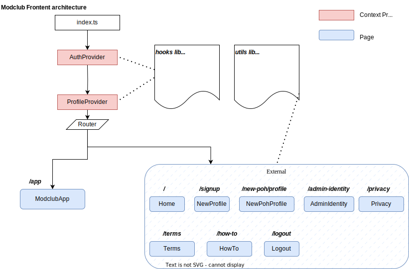

# Modclub

ModClub is a moderation platform for online apps deployed on the IC. Moderation as a service (MaaS) is the concept of outsourcing controversial decisions or risky content in order to protect users and maintain trust within communities.

# Prerequisites

- Dfx 0.20.1
- Node.js >=20.0.0

# Quick start

Follow the steps to start qa env on locally:

1. Start dfx server:  
   `dfx start --clean`

2. Delopy canisters locally:  
   `scripts/infra/up_infra.sh`

3. Start UI from modclub_assets:  
   `yarn start`

Go to `http://localhost:9000/` and will see the Modclub pages.

# Modclub Assets

The Modclub asset canister delivers assets for Modclub, crafted using the React framework.

## [Contexts](src/modclub_assets/src/contexts)

### AuthProvider

This is top-level provider for authentication. We've chosen [Connect2IC](https://github.com/Connect2IC) as our authentication library and have [tailored wallets specifically](src/modclub_assets/src/contexts/auth.tsx) for Modclub support.

The `useConnect()` hook offers insights such as connection status, principal. More details can be found [here](https://connect2ic.github.io/docs/docs/React/hooks).

### ProfileProvider

The ProfileProvider supplies fundamental user details, including email, ID, is_admin, and so on.

Use the useProfile() hook to access the ProfileContext.

## Hooks and Utils

You can leverage all hooks offered by Connect2IC, such as:

- [useWallet()](https://connect2ic.github.io/docs/docs/React/hooks#usewallet) for accessing wallet information and addresses.
- [useBalance()](https://connect2ic.github.io/docs/docs/React/hooks#usebalance) to retrieve a user's assets when their wallet is linked.

We've also developed proprietary hooks like:

- [useActors()](src/modclub_assets/src/hooks/actors.tsx) to fetch APIs from canisters.

utils/apis are also provided:

- [api.ts](src/modclub_assets/src/utils/api.ts) houses the majority of canister-related APIs.
- [jwt.ts](src/modclub_assets/src/utils/jwt.ts) includes APIs associated with JWT.
- [util.tx](src/modclub_assets/src/utils/util.ts) provides offers standalone utility functions.

## Loggings

[Customized logger](src/modclub_assets/src/utils/logger.ts) is provided to have controlled logging levels and environment-based filtering.

## Auto-generated files by environment

The [declarations_by_env.ts](src/modclub_assets/src/declarations_by_env.ts) file is [automatically generated](scripts/build/gen_files_by_env.cjs) to offer declarations specific to the current environment(prod/qa/dev).

## Running Local Tests

1. Ensure you have docker running 
2. Run `make run`
